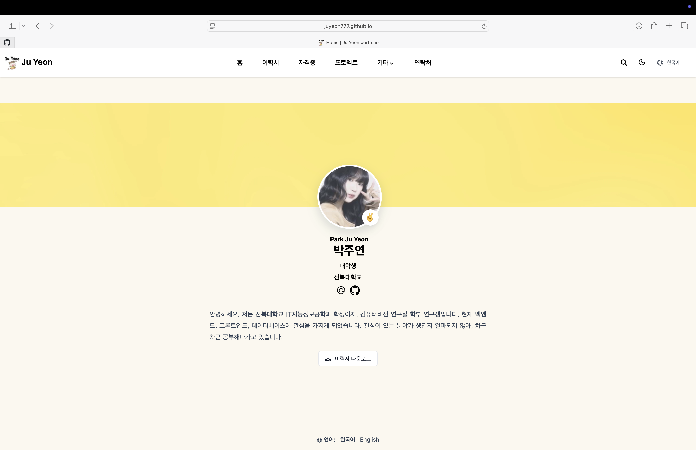

# 박주연 포트폴리오 · Ju Yeon Portfolio

프로젝트 · 이력 · 자격증 · 연락처를 한 곳에 정리한 개인 포트폴리오 웹사이트입니다.

🔗 **사이트 바로가기:** [https://juyeon777.github.io/WSD_portfolio/](https://juyeon777.github.io/WSD_portfolio/)
&nbsp;|&nbsp; 🇬🇧 [English](https://juyeon777.github.io/WSD_portfolio/en/)

[](https://juyeon777.github.io/WSD_portfolio/)

<br>

## 📋 구성

| 메뉴 | 내용 |
|------|------|
| **홈** | 자기소개 · 프로필 · 이력서(PDF) 다운로드 |
| **이력서** | 경력 / 학위 / 기술 / 언어 |
| **자격증** | 취득·준비 중인 자격증 |
| **프로젝트** | 진행한 프로젝트 (카드형 목록 + 상세 페이지, GitHub·배포 링크) |
| **연락처** | 연락 정보 · 지도 · 연락 폼 |

대표 프로젝트로는 **종자 증식실 디지털 트윈 시스템**(캡스톤), **시내버스 승객 예측**(KCI 논문 공동저자), **YeonHire 채용 플랫폼 백엔드**, **YeonPlay 프론트엔드** 등이 있습니다.

<br>

## 🛠 기술 스택

- **Hugo** (Extended) + **Hugo Blox Builder** — 블록 기반 정적 사이트 빌더
- **Tailwind CSS** + 커스텀 SCSS / JavaScript
- **다국어** 지원 (한국어 / English)
- **연락 폼** — Formspree 연동
- **GitHub Actions** 자동 빌드 → **GitHub Pages** 배포

<br>

## 🚀 로컬 실행

```bash
# Hugo Extended 0.126.3 이상 필요
hugo server
```

## 🌐 배포

`main` 브랜치에 push하면 GitHub Actions(`.github/workflows/publish.yaml`)가 자동으로 빌드하여 GitHub Pages에 배포합니다.

<br>

---

<sub>© 2026 박주연 (Park Ju Yeon) · 전북대학교 IT지능정보공학과</sub>
