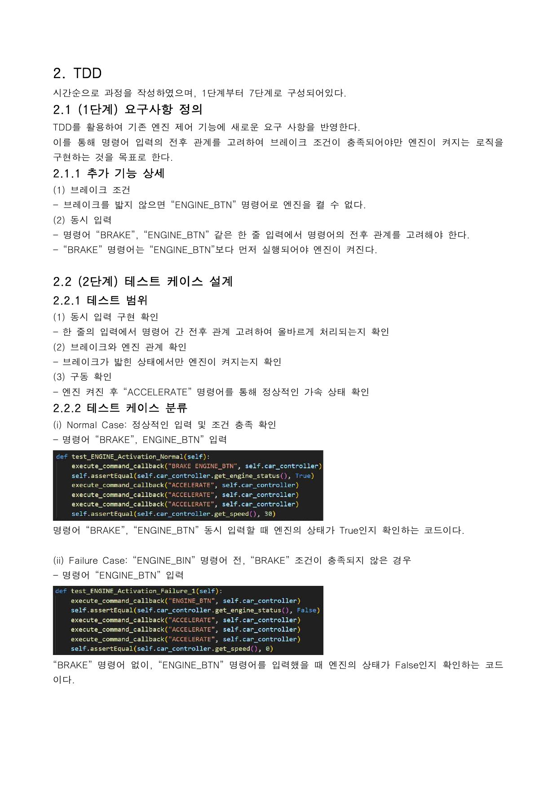

- **period:** 2024 Fall Semester (Software Engineering)
- A team project that modeled and implemented a car system (engine, accelerator/brake pedals, gear, doors/locks, trunk) in Python.
- We wrote a Software Requirements Specification (SRS), developed with TDD (Test-Driven Development), managed configuration with Git/GitHub/Sourcetree, and performed code inspection.
- Implemented and verified safety logic (the engine starts only when the brake is pressed) and order-aware concurrent command handling through TDD.
- **Role:** In charge of documentation / reports
- **Tech Stack:** Python, unittest (TDD), Git/GitHub, Sourcetree, PyCharm

[GitHub Repository](https://github.com/juyeon777/Software_Engineering_2024)
